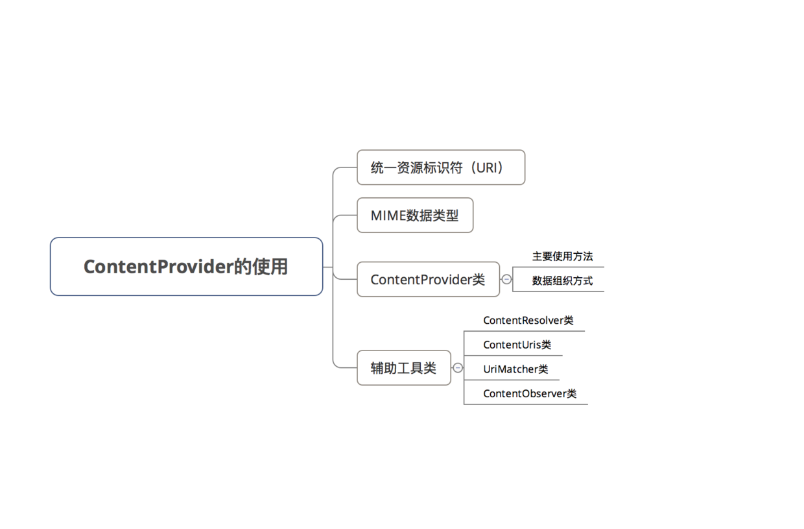
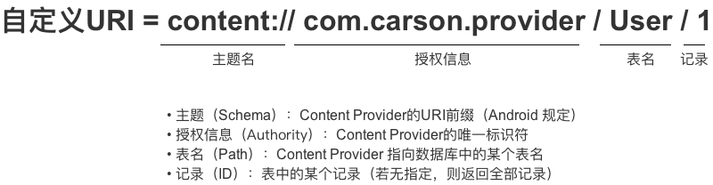

[回目录页](..)

# ContentProvider

ContentProvider，即内容提供者属于Android的四大组件之一。

# 1. 简介


**其底层是采用android中的Binder机制**

# 2. 具体使用



###  2.1 统一标识符（URI）

定义：Uniform Resource Identifier，即统一资源标识符

作用：唯一标识 ContentProvider & 其中的数据

外界进程通过 URI 找到对应的ContentProvider & 其中的数据，再进行数据操作

具体使用

URI分为 系统预置 & 自定义，分别对应系统内置的数据（如通讯录、日程表等等）和自定义数据库

关于 系统预置URI 此处不作过多讲解，需要的同学可自行查看
此处主要讲解 自定义URI



### 4.2 MIME数据类型

  MIME类型就是设定某种扩展名的文件用一种应用程序来打开的方式类型，当该扩展名文件被访问的时候，浏览器会自动使用指定应用程序来打开。多用于指定一些客户端自定义的文件名，以及一些媒体文件打开方式。

* 获取Mime类型获取方式

```
ContentProvider.geType(uri) ；
```
* MIME类型组成

每种MIME类型 由2部分组成 = 类型 + 子类型

```
text / html
// 类型 = text、子类型 = html

text/css
text/xml
application/pdf
```

### 4.3 ContentProvider类使用

* ContentProvider主要以表格的形式组织数据，同时也支持文件数据，只是表格形式用得比较多

* 主要方法

进程间共享数据的本质是：添加、删除、获取 & 修改（更新）数据

```
<-- 4个核心方法 -->
  public Uri insert(Uri uri, ContentValues values) 
  // 外部进程向 ContentProvider 中添加数据

  public int delete(Uri uri, String selection, String[] selectionArgs) 
  // 外部进程 删除 ContentProvider 中的数据

  public int update(Uri uri, ContentValues values, String selection, String[] selectionArgs)
  // 外部进程更新 ContentProvider 中的数据

  public Cursor query(Uri uri, String[] projection, String selection, String[] selectionArgs,  String sortOrder)　 
  // 外部应用 获取 ContentProvider 中的数据

// 注：
  // 1. 上述4个方法由外部进程回调，并运行在ContentProvider进程的Binder线程池中（不是主线程）
 // 2. 存在多线程并发访问，需要实现线程同步
   // a. 若ContentProvider的数据存储方式是使用SQLite & 一个，则不需要，因为SQLite内部实现好了线程同步，若是多个SQLite则需要，因为SQL对象之间无法进行线程同步
  // b. 若ContentProvider的数据存储方式是内存，则需要自己实现线程同步

<-- 2个其他方法 -->
public boolean onCreate() 
// ContentProvider创建后 或 打开系统后其它进程第一次访问该ContentProvider时 由系统进行调用
// 注：运行在ContentProvider进程的主线程，故不能做耗时操作

public String getType(Uri uri)
// 得到数据类型，即返回当前 Url 所代表数据的MIME类型
```

### 4.3 ContentResolver类

4.2 为什么要使用通过ContentResolver类从而与ContentProvider类进行交互，而不直接访问ContentProvider类？

一般来说，一款应用要使用多个ContentProvider，若需要了解每个ContentProvider的不同实现从而再完成数据交互，操作成本高 & 难度大
所以再ContentProvider类上加多了一个 ContentResolver类对所有的ContentProvider进行统一管理。


### 4.4 ContentObserver类

定义：内容观察者

作用：观察 Uri引起ContentProvider 中的数据变化 & 通知外界（即访问该数据访问者）

当ContentProvider 中的数据发生变化（增、删 & 改）时，就会触发该 ContentObserver类

**具体使用**

```

// 步骤1：注册内容观察者ContentObserver
getContentResolver().registerContentObserver（uri）；
// 通过ContentResolver类进行注册，并指定需要观察的URI

// 步骤2：当该URI的ContentProvider数据发生变化时，通知外界（即访问该ContentProvider数据的访问者）
public class UserContentProvider extends ContentProvider {
    public Uri insert(Uri uri, ContentValues values) {
        db.insert("user", "userid", values);
        getContext().getContentResolver().notifyChange(uri, null);
        // 通知访问者
    }
}

// 步骤3：解除观察者
getContentResolver().unregisterContentObserver（uri）；
// 同样需要通过ContentResolver类进行解除
至此，关于ContentProvider的使用已经讲解完毕
```

# 5. provider管理数据

使用步骤如下：

创建数据库类
自定义 ContentProvider 类
注册 创建的 ContentProvider 类
前2个步骤同上例相同，此处不作过多描述，此处主要讲解步骤3.

步骤3：注册 创建的 ContentProvider类 AndroidManifest.xml

````
<provider 
               android:name="MyProvider"
               android:authorities="scut.carson_ho.myprovider"

               // 声明外界进程可访问该Provider的权限（读 & 写）
               android:permission="scut.carson_ho.PROVIDER"             

               // 权限可细分为读 & 写的权限
               // 外界需要声明同样的读 & 写的权限才可进行相应操作，否则会报错
               // android:readPermisson = "scut.carson_ho.Read"
               // android:writePermisson = "scut.carson_ho.Write"

               // 设置此provider是否可以被其他进程使用
               android:exported="true"

  />

// 声明本应用 可允许通信的权限
    <permission android:name="scut.carson_ho.Read" android:protectionLevel="normal"/>
    // 细分读 & 写权限如下，但本Demo直接采用全权限
    // <permission android:name="scut.carson_ho.Write" android:protectionLevel="normal"/>
    // <permission android:name="scut.carson_ho.PROVIDER" android:protectionLevel="normal"/>

```

至此，进程1创建完毕，即创建ContentProvider & 数据 准备好了。

进程2
步骤1：声明可访问的权限

```
AndroidManifest.xml

    // 声明本应用可允许通信的权限（全权限）
    <uses-permission android:name="scut.carson_ho.PROVIDER"/>

    // 细分读 & 写权限如下，但本Demo直接采用全权限
    // <uses-permission android:name="scut.carson_ho.Read"/>
    //  <uses-permission android:name="scut.carson_ho.Write"/>

// 注：声明的权限必须与进程1中设置的权限对应
步骤2：访问 ContentProvider的类

public class MainActivity extends AppCompatActivity {

    @Override
    protected void onCreate(Bundle savedInstanceState) {
        super.onCreate(savedInstanceState);
        setContentView(R.layout.activity_main);

        /**
         * 对user表进行操作
         */

        // 设置URI
        Uri uri_user = Uri.parse("content://scut.carson_ho.myprovider/user");

        // 插入表中数据
        ContentValues values = new ContentValues();
        values.put("_id", 4);
        values.put("name", "Jordan");


        // 获取ContentResolver
        ContentResolver resolver =  getContentResolver();
        // 通过ContentResolver 根据URI 向ContentProvider中插入数据
        resolver.insert(uri_user,values);

        // 通过ContentResolver 向ContentProvider中查询数据
        Cursor cursor = resolver.query(uri_user, new String[]{"_id","name"}, null, null, null);
        while (cursor.moveToNext()){
            System.out.println("query book:" + cursor.getInt(0) +" "+ cursor.getString(1));
            // 将表中数据全部输出
        }
        cursor.close();
        // 关闭游标

        /**
         * 对job表进行操作
         */
        // 和上述类似,只是URI需要更改,从而匹配不同的URI CODE,从而找到不同的数据资源
        Uri uri_job = Uri.parse("content://scut.carson_ho.myprovider/job");

        // 插入表中数据
        ContentValues values2 = new ContentValues();
        values2.put("_id", 4);
        values2.put("job", "NBA Player");

        // 获取ContentResolver
        ContentResolver resolver2 =  getContentResolver();
        // 通过ContentResolver 根据URI 向ContentProvider中插入数据
        resolver2.insert(uri_job,values2);

        // 通过ContentResolver 向ContentProvider中查询数据
        Cursor cursor2 = resolver2.query(uri_job, new String[]{"_id","job"}, null, null, null);
        while (cursor2.moveToNext()){
            System.out.println("query job:" + cursor2.getInt(0) +" "+ cursor2.getString(1));
            // 将表中数据全部输出
        }
        cursor2.close();
        // 关闭游标
    }
}
```