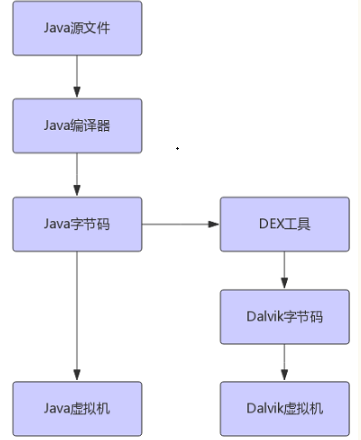
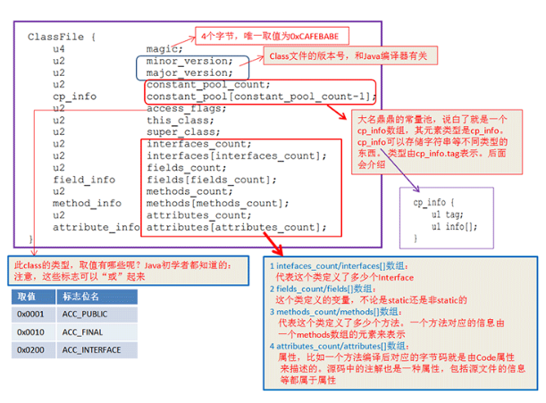
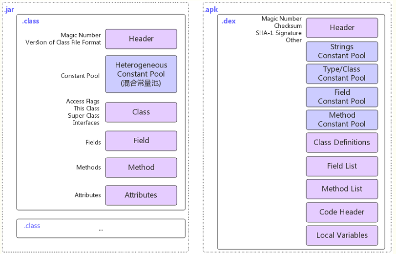
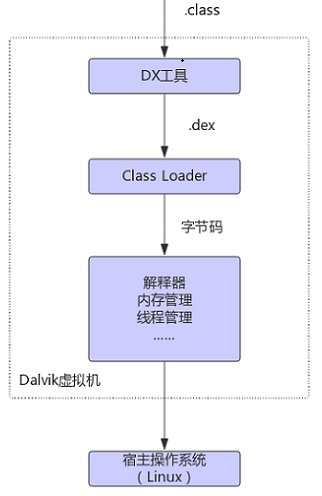
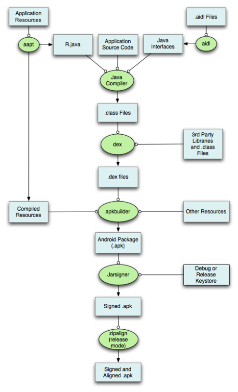

[回目录页](..)

# 1. Android虚拟机

   Dalvik是Google公司自己设计用于Android平台的Java虚拟机，它是Android平台的重要组成部分，支持dex格式（Dalvik Executable）的Java应用程序的运行

   它主要完成生命周期管理，堆栈管理，线程管理，安全和异常管理，以及垃圾回收等。

   体积小，占用内存空间小

   专有的dex可执行文件格式，执行数据更快

   常量池采用32位索引，寻址方法名，字段名，常量更快。也即是说常量池用于存储方法名，字段名，常量。

   基于寄存器架构，并拥有一套完整的指令系统。

   所有的android程序都运行再Android系统**进程**中，每个进程对应着一个**Dalvik虚拟机实例**

# 2. Dalvik虚拟机和Java虚拟机的区别

   两者有许多不同点，两者并不兼容。主要表现在：

* **2.1 Java虚拟机运行的是Java字节码，Dalvik虚拟机运行的是Dalvik字节码**

* **2.2 Dalvik可执行文件体积小。Android Sdk中有一个叫dx的工具负责将Java字节码转化未Dalvik字节码**

  >  消除其中的冗余信息，重新组合形成一个常量池，所有的类文件共享同一个常量池。  
  >  由于dx工具对常量池的压缩，使得相同的字符串，常量在DEX文件中只出现一次，从而减小了文件的体积。

* Java字节码格式

* Dalvik字节码格式

* 简单来讲，dex格式文件就是将多个class文件中公有的部分统一存放，去除冗余信息。

* Java虚拟机基于栈架构，程序在运行时虚拟机需要频繁的从栈上读取或写入数据，这个过程需要更多的指令分派与内存访问次数，会耗费不少CPU时间，对于像手机设备资源有限的设备来说，这是相当大的一笔开销。

* Dalvik虚拟机基于寄存器架构。数据的访问通过寄存器间直接传递，这样的访问方式比基于栈方式要快很多。

# 3. Dalvik虚拟机的结构

# 4. Android Apk打包过程

1.Java编译器对工程本身的java代码进行编译，这些java代码有三个来源：app的源代码，由资源文件生成的R文件(aapt工具)，以及有aidl文件生成的java接口文件(aidl工具)。产出为.class文件。

①用AAPT编译R.java文件

②编译AIDL的java文件

③把java文件编译成class文件

2..class文件和依赖的三方库文件通过dex工具生成Delvik虚拟机可执行的.dex文件，包含了所有的class信息，包括项目自身的class和依赖的class。产出为.dex文件。

3.apkbuilder工具将.dex文件和编译后的资源文件生成未经签名对齐的apk文件。这里编译后的资源文件包括两部分，一是由aapt编译产生的编译后的资源文件，二是依赖的三方库里的资源文件。产出为未经签名的.apk文件。

4.分别由Jarsigner和zipalign对apk文件进行签名和对齐，生成最终的apk文件。

总结为：编译-->DEX-->打包-->签名和对齐

# 5. ART虚拟机与Dalvik虚拟机的区别

### 5.1 ART简介

  ART代表Android Runtime，其处理应用程序执行的方式完全不同于Dalvik，Dalvik是依靠一个Just-In-Time (JIT)编译器去解释字节码。

  开发者编译后的应用代码需要通过一个解释器在用户的设备上运行，这一机制并不高效，但让应用能更容易在不同硬件和架构上运行。

  ART则完全改变了这套做法，在应用安装时就预编译字节码到机器语言，这一机制叫Ahead-Of-Time (AOT）编译。在移除解释代码这一过程后，应用程序执行将更有效率，启动更快。

### 5.2 ART优缺点

* **优点**

1. 系统性能的显著提升。
2. 应用启动更快、运行更快、体验更流畅、触感反馈更及时。
3. 更长的电池续航能力。
4. 支持更低的硬件。

* **缺点**

1. 更大的存储空间占用，可能会增加10%-20%。
2. 更长的应用安装时间

### 5.3  ART虚拟机相对于Dalvik虚拟机的提升

* **预编译阶段，Dalvik是动态编译成native code; ART是安装是及时编译成native**

在dalvik中，如同其他大多数JVM一样，都采用的是JIT来做及时翻译(动态翻译)，将dex或odex中并排的dalvik code(或者叫smali指令集)运行态翻译成native code去执行。JIT的引入使得dalvik提升了3~6倍的性能。

而在ART中，完全抛弃了dalvik的JIT，使用了AOT直接在安装时将其完全翻译成native code。这一技术的引入，使得虚拟机执行指令的速度又一重大提升。

* **垃圾回收机制**
首先介绍下dalvik的GC的过程。主要有有四个过程:

* 当gc被触发时候，其会去查找所有活动的对象，这个时候整个程序与虚拟机内部的所有线程就会挂起，这样目的是在较少的堆栈里找到所引用的对象；
注意：这个回收动作和应用程序非并发；
* gc对符合条件的对象进行标记；
* gc对标记的对象进行回收；
* 恢复所有线程的执行现场继续运行。

**dalvik这么做的好处是，当pause了之后，GC势必是相当快速的。  
但是如果出现GC频繁并且内存吃紧势必会导致UI卡顿、掉帧、操作不流畅等。**

后来ART改善了这种GC方式， 主要的改善点在将其非并发过程改成了部分并发，还有就是对内存的重新分配管理。

当ART GC发生时:

* GC将会锁住Java堆，扫描并进行标记；
* **标记完毕释放掉Java堆的锁**，并且挂起所有线程；
* GC对标记的对象进行回收；
* 恢复所有线程的执行现场继续运行；
* 重复2-4直到结束。
可以看出整个过程做到了部分并发使得时间缩短。据官方测试数据说GC效率提高2倍。

* **提高内存使用，减少碎片化**

Dalvik内存管理特点是:内存碎片化严重，当然这也是Mark and Sweep算法带来的弊端。

可以看出每次GC后内存千疮百孔，本来连续分配的内存块变得碎片化严重，之后再分配进入的对象再进行内存寻址变得困难。

ART的解决：在ART中，它将Java分了一块空间命名为Large-Object-Space，这块内存空间的引入用来专门存放large object。同时ART又引入了moving collector的技术，即将不连续的物理内存块进行对齐。对齐了后内存碎片化就得到了很好的解决。Large-Object-Space的引入是因为moving collector对大块内存的位移时间成本太高。根官方统计，ART的内存利用率提高10倍了左右，大大提高了内存的利用率。
