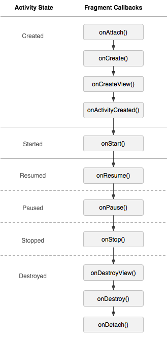

[回目录页](..)

# 1. Fragment详解

### 1.1 Fragment生命周期



Fragment比Activity多了几个生命周期的回调方法

* onAttach(Activity) 当Fragment与Activity发生关联的时候调用
* onCreateView(LayoutInflater, ViewGroup, Bundle) 创建该Fragment的视图
* onActivityCreated(Bundle) 当Activity的onCreated方法返回时调用
*  onDestroyView() 与onCreateView方法相对应，当该Fragment的视图被移除时调用
* onDetach() 与onAttach方法相对应，当Fragment与Activity取消关联时调用


Tips：注意：除了onCreateView，其他的所有方法如果你重写了，必须调用父类对于该方法的实现

###  1.2 静态使用Fragment
步骤：

① 创建一个类继承Fragment，重写onCreateView方法，来确定Fragment要显示的布局

② 在Activity中声明该类，与普通的View对象一样

```
<LinearLayout xmlns:android="http://schemas.android.com/apk/res/android"
    xmlns:tools="http://schemas.android.com/tools"
    android:layout_width="match_parent"
    android:layout_height="match_parent"
    android:orientation="vertical"
    tools:context="com.usher.fragment.MainActivity">

    <TextView
        android:layout_width="match_parent"
        android:layout_height="100dp"
        android:gravity="center"
        android:text="Good Boy" />

   //静态使用Fragment，即是直接在xml中声明
    <fragment
        android:id="@+id/myfragment"
        android:name="com.usher.fragment.MyFragment"
        android:layout_width="match_parent"
        android:layout_height="match_parent" />

</LinearLayout>
```

### 1.3 动态使用Fragment

```
fragment1 = new MyFragment();
        fragment2 = new MyFragment2();

        //初始化FragmentManager对象
        manager = getSupportFragmentManager();

        //使用FragmentManager对象用来开启一个Fragment事务
        FragmentTransaction transaction = manager.beginTransaction();

        //默认显示fragment1
        transaction.add(R.id.myframelayout, fragment1).commit();

        //对bt_red设置监听
        bt_red.setOnClickListener(new View.OnClickListener() {
            @Override
            public void onClick(View v) {
                FragmentTransaction transaction = manager.beginTransaction();
                transaction.replace(R.id.myframelayout, fragment1).commit();
            }
        });
```

以上代码我写的比较臃肿但是比较容易看明白：

① 在Acitivity对应的布局中写上一个FramLayout控件，此空间的作用是当作Fragment的容器，Fragment通过FrameLayout显示在Acitivity里，这两个单词容易混淆，请注意

② 准备好你的Fragment，然后再Activity中实例化，v4包的Fragment是通过getSupportFragmentManager()方法新建Fragment管理器对象，此处不讨论app包下的Fragment

③ 然后通过Fragment管理器对象调用beginTransaction()方法，实例化FragmentTransaction对象，有人称之为事务

④ FragmentTransaction对象【以下直接用transaction代替】，transaction的方法主要有以下几种：

* transaction.add() 向Activity中添加一个Fragment
* transaction.remove() 从Activity中移除一个Fragment，如果被移除的Fragment没有添加到回退栈（回退栈后面会详细说），这个Fragment实例将会被销毁
* transaction.replace() 使用另一个Fragment替换当前的，实际上就是remove()然后add()的合体
* transaction.hide() 隐藏当前的Fragment，仅仅是设为不可见，并不会销毁
* transaction.show() 显示之前隐藏的Fragment
* detach() 会将view从UI中移除,和remove()不同,此时fragment的状态依然由FragmentManager维护
* attach() 重建view视图，附加到UI上并显示
* ransatcion.commit() 提交事务

注意：在add/replace/hide/show以后都要commit其效果才会在屏幕上显示出来

# 2. Fragment回退栈

### 2.1 回退栈定义

Fragment的回退栈是用来保存每一次Fragment事务发生的变化 如果你将Fragment任务添加到回退栈，当用户点击后退按钮时，将看到上一次的保存的Fragment。一旦Fragment完全从后退栈中弹出，用户再次点击后退键，则退出当前Activity

### 2.2 具体使用

```
        FragmentThree fThree = new FragmentThree();  
        FragmentManager fm = getFragmentManager();  
        FragmentTransaction tx = fm.beginTransaction();  
        tx.hide(this);  
        tx.add(R.id.id_content , fThree, "THREE");  
        //tx.replace(R.id.id_content, fThree, "THREE");  
        tx.addToBackStack(null);  
        tx.commit(); 
```

# 3. Fragment与Activity之间的通信

* 如果你Activity中包含自己管理的Fragment的引用，可以通过引用直接访问所有的Fragment的public方法
* 如果Activity中未保存任何Fragment的引用，那么没关系，每个Fragment都有一个唯一的TAG或者ID,可以通过getFragmentManager.findFragmentByTag()或者findFragmentById()获得任何Fragment实例，然后进行操作
* Fragment中可以通过getActivity()得到当前绑定的Activity的实例，然后进行操作。

# 4. 如何处理运行时配置发生变化

**问题引入**
因为当屏幕发生旋转，Activity发生重新启动，默认的Activity中的Fragment也会跟着Activity重新创建，用脚趾头都明白...横屏和竖屏显示的不一样肯定是进行了重新绘制视图的操作。所以，不断的旋转就不断绘制，这是一种很耗费内存资源的操作，那么如何来进行优化？

**问题解决方案**

我们简单改一下代码，判断只有在savedInstanceState==null时，才进行创建Fragment实例

```
public class MainActivity extends Activity {

    private static final String TAG = "FragmentOne";  
    private FragmentOne mFOne;  

    @Override  
    protected void onCreate(Bundle savedInstanceState) {  
        super.onCreate(savedInstanceState);  
        requestWindowFeature(Window.FEATURE_NO_TITLE);  
        setContentView(R.layout.activity_main);  

        Log.e(TAG, savedInstanceState+"");  

        if(savedInstanceState == null) {  
            mFOne = new FragmentOne();  
            FragmentManager fm = getFragmentManager();  
            FragmentTransaction tx = fm.beginTransaction();  
            tx.add(R.id.id_content, mFOne, "ONE");  
            tx.commit();  
        }  
    }  

}
```