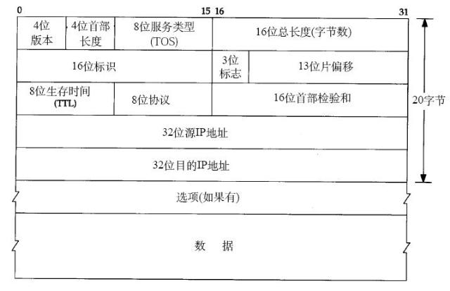

[回目录页](..)

# TCP/IP相关

 如上图所示，tcp/ip相关知识包含多层内容

* TCP/IP模式
* 数据链路层
* 网络层
* ping
* traceroute
* tcp/udp
* dns
* tcp连接的建立和终止
* tcp流量控制
* tcp拥塞控制

# 1. TCP/IP协议模型

  TCP/IP包含了一系列构成互联网基础的网络协议，是Internet的核心协议

* 应用层：http,ftp等
* 传输层：TCP和UDP协议
* 网络层：IP协议，它负责堆数据加上IP地址和其他数据以确定传输的目标
* 网络接口层：数据链路层，为待传输的数据加入一个以太网头，并进行CRC编码，为最后的数据传输做准备

**Http应用层协议得数据封装传输过程**

# 2. 数据链路层

 把IP协议封装过的数据转化为二级制数据，并把这些二进制数据转成数据帧从一个节点传输到临近得另外一节点，这些节点是通过Mac来唯一标识的

 

* 封装成帧：把网络层数据报加头和尾，封装成帧，帧头中包括源MAC地址和目的MAC地址。
* 透明传输：零比特填充、转义字符。
* 可靠传输：在出错率很低的链路上很少用，但是无线链路WLAN会保证可靠传输。
* 差错检测(CRC)：接收者检测错误,如果发现差错，丢弃该帧。

# 3. 网络层（IP协议）

  IP协议是ICP/IP协议的核心，所有的TCP，UDP,ICMP,IGCP的数据都是以IP数据格式传输。
  
  IP协议是TCP/IP协议簇的核心，它为上层(传输层)协议(TCP/UDP)提供无状态、无连接、不可靠的服务。
  
*  (1) 无状态: IP通信双方的数据状态信息不同步，即所有的IP数据报的发送、传输、接收都是相互独立的，没有上下文关系。优点是简单高效，不占用内核结构来保存通信状态，每次传输数据时不用携带状态信息
*  (2) 无连接: IP通信双方不能长久地维持对方的任何信息。上层协议每次发送数据时都需要指明通信对方的地址
*  (3) 不可靠: 不能保证IP数据报准确地到达接收端，它只是承诺尽最大的努力

  **注意：** IP不是可靠的协议，其没有提供数据未传达以后的处理机制，数据传输的可靠性是传输层ICP/udp要做的事情

### 3.1 IP协议

* A类IP地址：1.0.0.0~127.0.0.0
* B类IP地址：128.0.0.0~191.255.255.255
* C类IP地址：192.0.0.0~223.255.255.2

### IP协议头

IPxyi协议头总长度是20字节，二进制来说， 及时20*8个bit。上图中的数字单位是bit.具体说明如下：

**第一个4Byte内容主要是基础信息：**

* 版本号（4 bit）：IP协议的版本号，IPv4协议对应的就是4.
* IP头长度(4 bit)：标识IP头的长度，其数字说明的长度是字。 转化成十进制就是要：IP头长度*4.
* 服务类型TOS（8 bit）: 3bit优先权字段 + 4bit TOS字段+1bitbao保留子弹。其中优先权子弹已经废弃，
         4bit服务类型字段分别标识：最小延时-，最大吞吐量—T，最高可靠性-R，最小费用-M。四个类型只能同时满足一个要求，即这四位只能有一个bit等于1.应用程序根据实际需要来设置 TOS值，如ssh和telnet这样的登录程序需要的是最小延时的服务，文件传输ftp需要的是最大吞吐量的服务
* 总长度（16bit）:单位是字节，也就是说明IP 数据包最多（最大值）能传输65535 Byte ,但由于传输层其实也会限制IP 数据长度（MTU），长度超过MTU的报文都将被分片传输，所以实际场景中，IP分片数据报文远远没有达到最大值

**第二个4Byte内容主要是数据分片信息：**

* 标识（16bit）:唯一标识标识主机发送的每个数据报，初始值随机生成，之后逐步加1。同一个数据报的分片这个标识都是相同的
* 标志（3bit） :分片类型标志。bit 1保留. bit 2 标志禁止分片，若是数据报长度超过物理传输层的mtu，则会丢弃该数据波，并返回icmp差错报文。bit 3标识是否有更多分片，最后一个分片的这个bit为0，其他分片为1.
* 位移（13bit）:分片相对原始IP数据报数据部分的偏移。实际的偏移值为该值左移3位后得到的，所以除了最后一个IP数据报分片外，每个IP分片的数据部分的长度都必须是8的整数倍

**第三个4Byte内容主要是存活时间和校验信息**         
* 生存时间（8bit）：数据报到达目的地之前允许经过的路由器跳数.防止数据包陷入路由循环。
* 协议(8bit)：IP之上的类型。在Linux系统的/etc/protocols文件中定义了所有上层协议对应的协议字段，ICMP为1，TCP为6，UDP为17
* 头部数据校验和（16bit）:由发送端填充接收端对其使用CRC算法校验，检查IP数据报头部在传输过程中是否损坏

**第三个和第四个4Byte分别标识源IP地址和目标IP地址**

源IP地址和目的IP地址（各32bit）: 表示数据报的发送端和接收端。一般情况下这两个地址在整个数据报传递过程中保持不变，不论中间经过多少个路由器

**IP头可选内容，最多40Byte，一般填充的内容有：**
  a. 记录路由: 记录数据包途径的所有路由的IP，这样可以追踪数据包的传递路径
  b. 时间戳: 记录每个路由器数据报被转发的时间或者时间与IP地址对，这样就可以测量途径路由之间数据报的传输的时间
  c. 松散路由选择: 指定路由器的IP地址列表数据发送过程中必须经过所有的路由器
  d. 严格路由选择: 数据包只能经过被指定的IP地址列表的路由器
  e. 上层协议(如TCP/UDP)的头部信息

### 3.2 ARP和RARP

ARP 是根据IP地址获取MAC地址的一种协议。

ARP（地址解析）协议是一种解析协议，本来主机是完全不知道这个IP对应的是哪个主机的哪个接口，当主机要发送一个IP包的时候，会首先查一下自己的ARP高速缓存（就是一个IP-MAC地址对应表缓存）。

如果查询的IP-MAC值对不存在，那么主机就向网络发送一个ARP协议广播包，这个广播包里面就有待查询的IP地址，而直接收到这份广播的包的所有主机都会查询自己的IP地址。如果收到广播包的某一个主机发现自己符合条件，那么就准备好一个包含自己的MAC地址的ARP包传送给发送ARP广播的主机。

而广播主机拿到ARP包后会更新自己的ARP缓存（就是存放IP-MAC对应表的地方）。发送广播的主机就会用新的ARP缓存数据准备好数据链路层的的数据包发送工作。

RARP协议的工作与此相反，不做赘述。

### 3.3 ICMP协议

IP协议并不是一个可靠的协议，它不保证数据被送达，那么，自然的，保证数据送达的工作应该由其他的模块来完成。其中一个重要的模块就是ICMP(网络控制报文)协议。ICMP不是高层协议，而是IP层的协议。

当传送IP数据包发生错误。比如主机不可达，路由不可达等等，ICMP协议将会把错误信息封包，然后传送回给主机。给主机一个处理错误的机会，这 也就是为什么说建立在IP层以上的协议是可能做到安全的原因。

# 4. Ping

ping可以说是ICMP的最著名的应用，是TCP/IP协议的一部分。利用“ping”命令可以检查网络是否连通，可以很好地帮助我们分析和判定网络故障。

# 5. Traceroute

Traceroute是用来侦测主机到目的主机之间所经路由情况的重要工具，也是最便利的工具。

Traceroute的原理非常非常有意思。它收到到目的主机的IP后，首先给目的主机发送一个TTL=1（Time To Live）的UDP数据包，而经过的第一个路由器收到这个数据包以后，就自动把TTL减1，而TTL变为0以后，路由器就把这个包给抛弃了，并同时产生一个主机不可达的ICMP数据报给主机。主机收到这个数据报以后再发一个TTL=2的UDP数据报给目的主机，然后刺激第二个路由器给主机发ICMP数据报。如此往复直到到达目的主机。这样，traceroute就拿到了所有的路由器IP。

# 6. 传输层协议TCP/UDP

**面向报文**

> 面向报文的传输方式是应用层交给UDP多长的报文，UDP发送多长的报文，即一次发送一个报文。因此，应用程序必须选择合适大小的报文。若报文太长，则IP层需要分片，降低效率；若太短，会使IP数据报太小。

**面向字节流**

> 面向字节流的话，虽然应用程序和TCP的交互是一次一个数据块（大小不等），但TCP把应用程序看成是一连串的无结构的字节流。TCP有一个缓冲，当应用程序传送的数据块太长，TCP就可以把它划分短一些再传送。

**TCP和UDP的引用层协议对比：**
  DNS是基于UDP协议

# 7. DNS

* DNS（Domain Name System，域名系统），因特网上作为域名和IP地址相互映射的一个分布式数据库，能够使用户更方便的访问互联网，而不用去记住能够被机器直接读取的IP数串。
* 通过主机名，最终得到该主机名对应的IP地址的过程叫做域名解析（或主机名解析）。
* DNS协议运行在**UDP**协议之上，使用端口号53

# 8. TCP的建立与终止

### 8.1 TCP三次握手

 * 为什么要三次握手？
     为了防止已失效的连接请求报文段突然又传送到了服务端, 若是服务端把客户端失效的连接请求进行直接认可连接成功的话， 那就出现了服务端建立成功的连接，客户端又是失败的。两端出现状态不一致的情况

### 8.2 TCP四次挥手

  TCP是面向连接的，可靠的，基于字节流的传输层协议，是全双公的协议。
  
  这意味着，单主机1发送了FIN，只是说明了主机1没有数据继续发送了，但它还是可以接收主机2的数据；FIN=1  SEQ=X
  
  当主机2回复主机1的FIN信息发送ack数据时，则表示其知道主机1数据已经发送完成，并且把主机2的剩余数据发送完成. ACK= X+1, Seq = Z
  
  当主机2也发送FIN，并带有ACK= X，Seq =Y。此时主机2也没有数据发送了。之后就是主机1回复ACK =Y ,SQP =X，主机2收到后直接断开连接; 主机1就是等待2 MSL的时间没收到服务端数据则关闭连接。
  
**为什么要等待2MSL？**

MSL：报文段最大生存时间，它是任何报文段被丢弃前在网络内的最长时间。
* 保证TCP协议的全双工连接能够可靠关闭：主机2没有收到主机1最后一次握手发送的ACK信号的情况会有意外
* 保证这次连接的重复数据段从网络中消失：重连之后，端口号一样，此时有数据驻留在网络传输中时，数据混淆问题。

# 9. TCP的流量控制

   所谓流量控制， 就是接收方告诉发送方数据不要发送太快；主要是利用滑动窗口的机制来控制，关键字是rwnd（receiver window）
   
   大写ACK表示首部中的确认位ACK，小写ack表示确认字段的值ack
   
   TCP为每一个连接设有一个**持续计时器**(persistence timer)。当TCP连接中的发送方收到接收方的**零窗口：拒绝接受数据**通知时，发送方就启动持续计时器。若持续计时器设置的时间到期，发送方就发送一个零窗口控测报文段（携1字节的数据）给接收方。如果接收方可以接收数据，就重新开始发送数据；如果接收方不能接收数据，就重新设置持续计时器。
   
# 10. TCP拥塞控制   

### 10.1 慢开始和拥塞避免

**发送方**维持一个拥塞窗口**cwnd**( congestion window )的状态变量。拥塞窗口的大小取决于网络的拥塞程度，并且动态地在变化。发送方让自己的发送窗口等于拥塞窗口。

发送方控制拥塞窗口的原则是：只要网络没有出现拥塞，拥塞窗口就再增大一些，以便把更多的分组发送出去。但只要网络出现拥塞，拥塞窗口就减小一些，以减少注入到网络中的分组数。

**慢开始算法：2的指数增长**

在刚刚开始发送报文段时，先把拥塞窗口 cwnd 设置为一个最大报文段**MSS**（Maximum Segment Size，最大报文长度）的数值。
而在每收到一个对新的报文段的确认后，把拥塞窗口增加至多一个MSS的数值（底数为2的指数增长规律）。
用这样的方法逐步增大发送方的拥塞窗口 cwnd ，可以使分组注入到网络的速率更加合理

为了防止拥塞窗口cwnd增长过大引起网络拥塞，还需要设置一个慢开始门限ssthresh状态变量。**慢开始门限ssthresh**的用法如下：

* 当 cwnd < ssthresh 时，使用上述的慢开始算法。
* 当 cwnd > ssthresh 时，停止使用慢开始算法而改用拥塞避免算法。
* 当 cwnd = ssthresh 时，既可使用慢开始算法，也可使用拥塞控制避免算法。

**拥塞避免：加1情况下的线性增长**

即每经过一个往返时间RTT就把发送方的拥塞窗口cwnd加1，而不是加倍。

只要发送方判断网络出现拥塞（其根据就是没有收到确认），就要把慢开始门限ssthresh设置为出现拥塞时的发送方窗口值的一半（但不能小于2）。然后把拥塞窗口**cwnd重新设置为1**，执行慢开始算法

### 10.2 快重传和快恢复

**快重传**

快重传算法还规定，发送方只要一连收到三个重复确认就应当立即重传对方尚未收到的报文段M3，而不必 继续等待M3设置的重传计时器到期。

由于发送方尽早重传未被确认的报文段，因此采用快重传后可以使整个网络吞吐量提高约20%。

**快恢复**

与快重传配合使用的还有快恢复算法，其过程有以下两个要点：

* 当发送方连续收到三个重复确认，就执行“乘法减小”算法，把慢开始门限ssthresh减半。与拥塞规避类似

* 与慢开始不同之处是现在不执行慢开始算法（即拥塞窗口cwnd现在不设置为1），而是把cwnd值设置为慢开始门限ssthresh减半后的数值，然后开始执行拥塞避免算法（“加法增大”），使拥塞窗口缓慢地线性增大。

